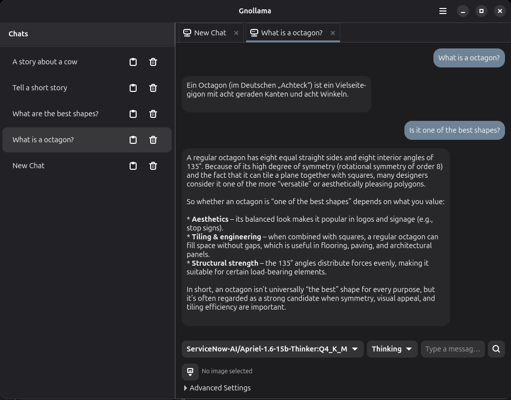

# gnollama

A Gnome user interface to [Ollama](https://ollama.com)

## Description

A GNOME user interface to Ollama. Written in Python.

Supports multiple tabs of model responses to Ollama endpoint /api/generate and /api/chat

Select "New Response" to create a new generate tab using /api/generate.

Select "New Chat" to create a new chat tab using /api/chat with previous messages so context is preserved.

Displays the "Thinking" stream in a fieldset in the response bubble.

Support saving chats and their options between sessions and a list of chats in a sidebar.

Both tab types support selecting multiple images to pass to the model.

Responses render Markdown and implement code highlighting.

Each tab supports entering any host. Model selection options populated from host.

Model selection, thinking, system prompt, statistics, logprobs, and other options (e.g. temperature)





## Build

*gnollama* can be built and run with [GNOME Builder](https://wiki.gnome.org/Apps/Builder).

1. Open GNOME Builder
2. Click the **Clone Repository** button
3. Enter `https://github.com/jackrabbithanna/gnollama.git` in the field **Repository URL**
4. Click the **Clone Project** button
5. Click the **Run** button to start building application

### Meson

Requires python3 and markdown
Code highlighting requires [GTKSourceView](https://wiki.gnome.org/Projects/GtkSourceView) version 5

To install in Ubuntu:
```bash
apt-get install libgtksourceview-5-0 libgtksourceview-5-common libgtksourceview-5-dev
apt-get install gir1.2-gtksource-5
apt-get install python3-markdown python3-gi
```

```bash
meson setup build
meson compile -C build
meson install -C build
```
You can then run `gnollama` to execute the application.

## TODO

Manage multiple hosts in configuration

Manage models for each host

More UI Multi-lingual translations


## License

*gnolamma* is released under the terms of the [GNU General Public License V3](https://www.gnu.org/licenses/gpl-3.0.html).

No warranty provided. No guarantee it does anything at all. Use at your own risk.
