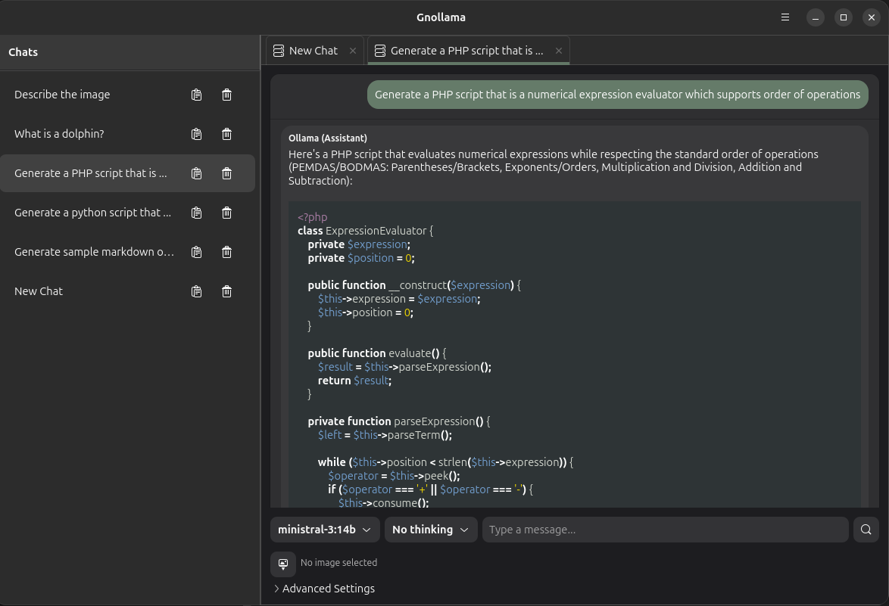
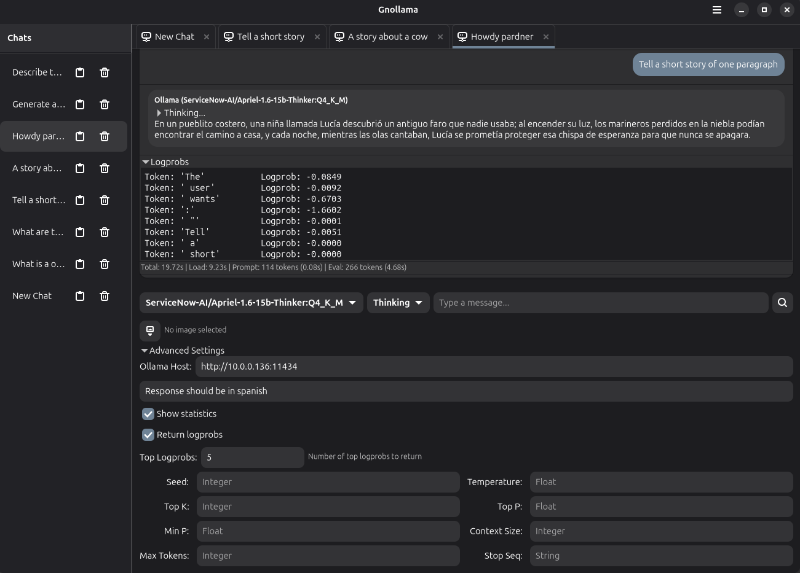
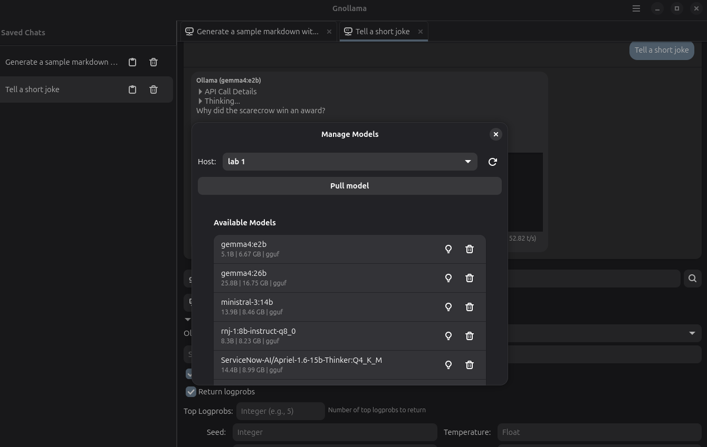

<div align="center">

# Gnollama

</img>

A Gnome user interface to [Ollama](https://ollama.com)
</div>

## Description

A GNOME user interface to Ollama. Written in Python.

Manage multiple hosts. Add / remove hosts and set default host. Tests host connectivity.

Each chat tab supports using any configured host. Model selection options populated from host.

Model management dialog. Lists all models for selected host. Allows pulling and deleting models. Shows full details about a model including size, parameters, modelfile, template, and license.

Supports multiple tabs of model responses to Ollama endpoint /api/generate and /api/chat

Select "New Response" to create a new generate tab using /api/generate.

Select "New Chat" to create a new chat tab using /api/chat with previous messages so context is preserved.

Displays the "Thinking" stream in a fieldset in the response bubble.

Optionally displays the logprobs and response statistics in the response.

Supports saving chats and their options between sessions and a chat history list in a sidebar.

Both tab types support selecting multiple images to pass to the model.

Responses render Markdown and implement code highlighting.

Model selection, thinking, system prompt, statistics, logprobs, and other options (e.g. temperature)








## Motivation

I wanted a GNOME application for Ollama that I could use to test and experiment with different models. I have multiple computers with Ollama and wanted a way to easily query and compare the responses from all of them using the same interface. Perhaps others would find this useful as well so here you go.

## Build

*gnollama* can be built and run with [GNOME Builder](https://wiki.gnome.org/Apps/Builder).

1. Open GNOME Builder
2. Click the **Clone Repository** button
3. Enter `https://github.com/jackrabbithanna/gnollama.git` in the field **Repository URL**
4. Click the **Clone Project** button
5. Click the **Run** button to start building application

### Meson

Requires python3 and markdown
Code highlighting requires [GTKSourceView](https://wiki.gnome.org/Projects/GtkSourceView) version 5

To install in Ubuntu:
```bash
apt-get install libgtksourceview-5-0 libgtksourceview-5-common libgtksourceview-5-dev
apt-get install gir1.2-gtksource-5
apt-get install python3-markdown python3-gi
```

```bash
meson setup build
meson compile -C build
meson install -C build
```
You can then run `gnollama` to execute the application.

## TODO

*   Code architecture improvements and optimizations (see [code-analysis-improvement-plan-2.md](./code-analysis-improvement-plan-2.md))
*   Save chat history in SQLite
*   More UI Multi-lingual translations
*   Consider how to add tool calls response fieldset and allow the user to set optional list of function tools the model may call during the chat
*   Embeddings?
 
## Contribute

The [GNOME Code of Conduct](https://conduct.gnome.org/) is applicable to this project


## License

*gnollama* is released under the terms of the [GNU General Public License V3](https://www.gnu.org/licenses/gpl-3.0.html).

No warranty provided. No guarantee it does anything at all. Use at your own risk.
