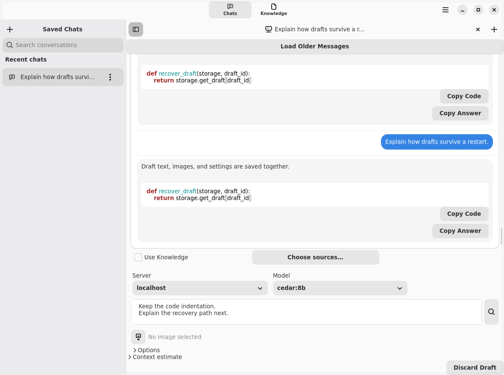
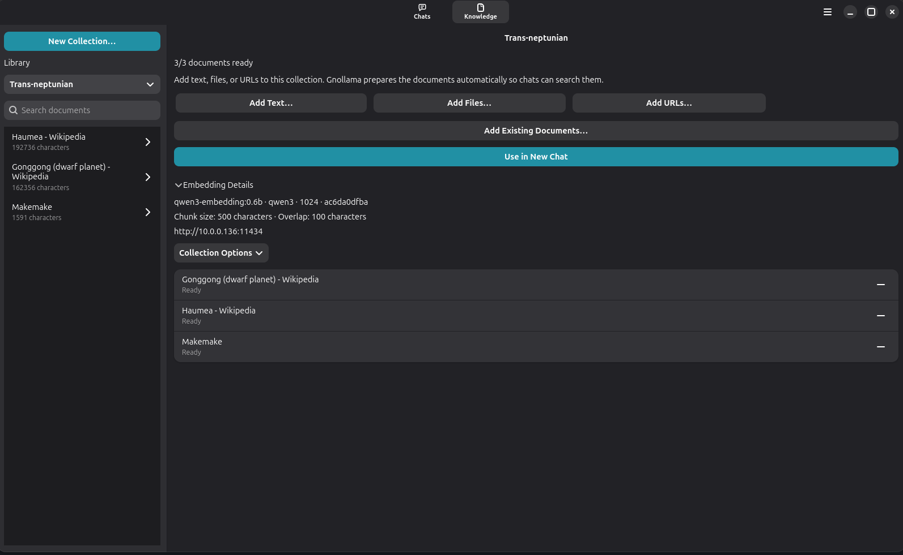
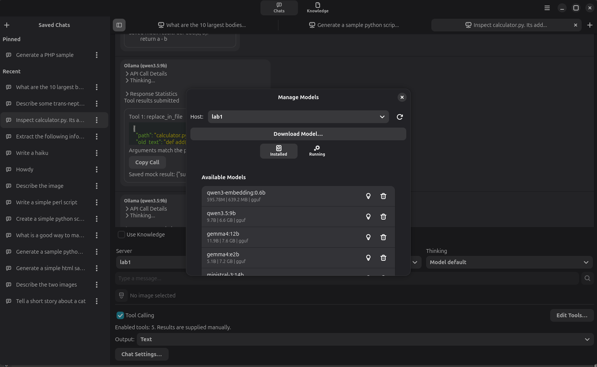
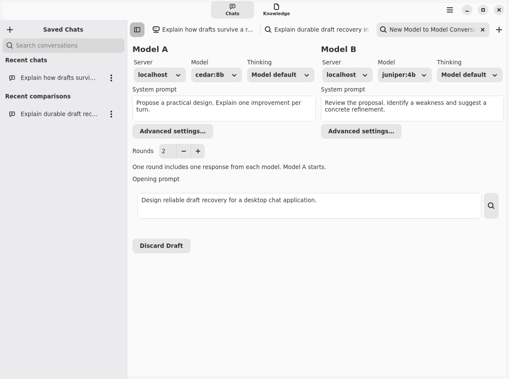
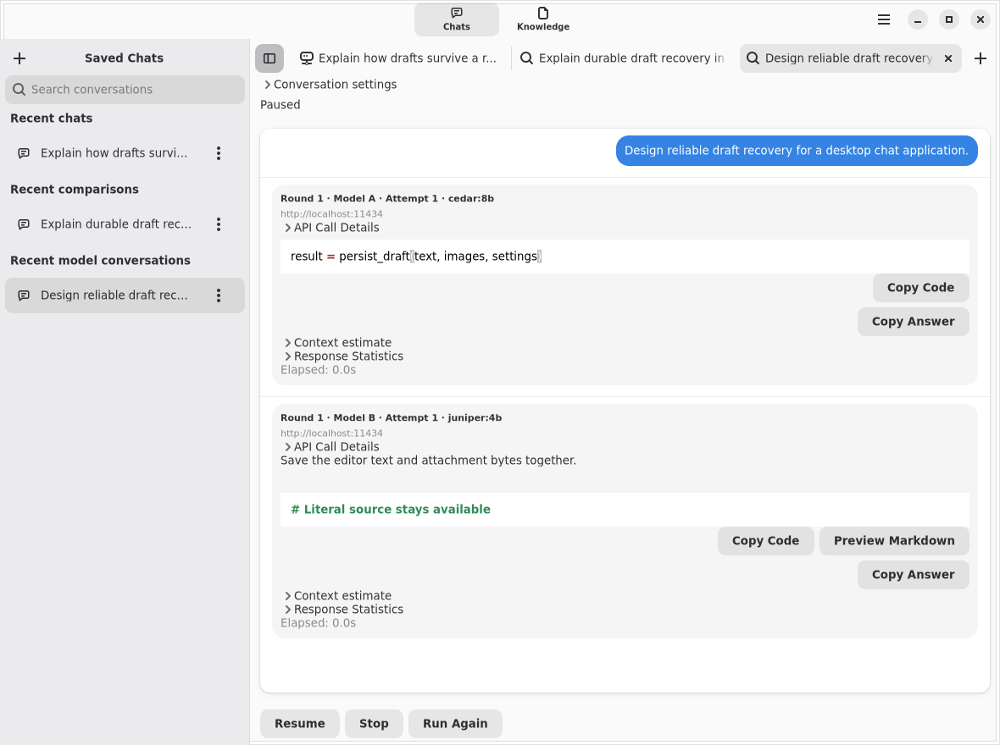

<div align="center">

# Gnollama

</img>

A Gnome user interface to [Ollama](https://ollama.com)
</div>

## Description

**Gnollama** is a modern, feature-rich GNOME user interface for [Ollama](https://ollama.com) built using Python, GTK4, and Libadwaita. It provides a native, responsive Linux desktop experience for interacting with LLMs.

Whether you are developing, experimenting, or chatting with local models, Gnollama makes it easy to run prompts across multiple local or remote hosts simultaneously.

## Features

* **Multi-Host Management**: Connect to local Ollama servers, remote servers, or Ollama Cloud. Add, edit, or delete configurations, verify host status, and define a default host.
* **Generation Workflows**:
  * **New Chat (`/api/chat`)**: Multi-turn sessions that preserve conversation context.
  * **New Response (`/api/generate`)**: Single-turn completions ideal for prompt engineering and testing.
  * **Model to Model Conversation**: Alternating A/B conversations with separate system prompts, bounded rounds, pause/resume, and saved transcripts.
  * Model lists appear before capability checks. Only the selected model is checked; models known to be embedding-only are excluded from all generation modes. Opening an empty selector retries discovery. Embedding models remain available in Knowledge and Manage Models; unknown capabilities remain supported for older servers.
* **Conversation History & Sidebar**:
  * Automatically saves chat logs and model configurations between runs.
  * **Pin Chats**: Pin essential conversations to the top of your history list.
  * **Popover Options**: Use a three-vertical-dots menu on any saved chat to quickly Pin, Rename, or Delete.
* **Model Manager**:
  * Pull or delete models directly from the UI.
  * View comprehensive model info, including size, parameter specifications, Modelfiles, templates, and licenses.
  * Switch between Installed and Running models for the selected host. Inspect memory, VRAM, context length, and expiry, or unload a model while keeping its downloaded files.
  * Running models refresh every five seconds while that view is visible. Unload is unavailable while Gnollama has an active response using the model.
* **Structured Output**: Choose Text, JSON, or JSON Schema below the image controls in either Chat or Response tabs. Paste or import a schema, validate responses locally, and copy or save JSON. The raw response and validation result remain in saved chat history.
* **Tool Calling Playground**: Define function tools in Chat tabs, inspect model calls and argument validation, supply mock results, and continue with the current model and settings. Import/export definitions as JSON and reopen pending rounds from saved history.
* **Knowledge Library and RAG**: Import text and PDFs, organize multi-document collections, create local embeddings with Ollama, inspect vectors, and search selected collections using cosine, Euclidean, or Manhattan comparison. Chats retain the passages used for each answer.
  * **Add URLs**: Review batches of web pages, PDFs, or text URLs before adding them to a collection. Extract main content automatically or use a CSS selector, edit the preview, and retain source URLs in chat citations.
* **Model Lifetime**: Choose the server default, unload after a reply, five or thirty minutes, indefinitely, or a custom duration in seconds in **Chat Settings…**. This setting applies to requests from that tab.
* **Rich Markdown & Code Rendering**: Full Markdown support and code syntax highlighting (powered by GTKSourceView 5).
* **Multimodal Image Support**: Upload and attach multiple images to your prompts for vision-enabled models.
  * Models explicitly lacking vision cannot receive new attachments. Earlier images remain visible and saved but are omitted from outgoing history for those models, with a notice in the composer.
  * Hosts without capability metadata retain manual image support, marked as unknown.
* **Thinking & completion Details**:
  * Separate display of Ollama's native thinking stream, with model-dependent thinking controls.
  * Display generation stats (including cached prompt tokens, finish reason, and tokens/second) and logprobs.
* **Stop Responses**: Stop generation while keeping partial answers in chat history. Pending history writes finish before the application quits.
* **Adaptive GNOME Navigation**: Native tabs support reordering and loading indicators. The sidebar groups Drafts, Pinned, Recent chats, Recent comparisons, and Recent model conversations, and collapses on narrow windows. Use Ctrl+W to close a tab, Ctrl+Page Up/Down to switch tabs, and F9 to toggle the sidebar.

### Ollama Cloud

In **Manage Hosts**, add a host and choose **Ollama Cloud**. Create an API key at [Ollama's API-key settings](https://ollama.com/settings/keys), paste it into the masked field, and save. The service address is filled in automatically. Select this host in either a Chat or Response tab; no local Ollama installation or model download is needed.

Keys are stored through libsecret in the desktop keyring (using its portal backend in Flatpak), separately from the host database and conversation history. Leave the key field blank when editing to retain the existing key. If the keyring is unavailable, **Use for This Session** keeps the entered key in memory until Gnollama exits. After restarting, enter it again unless a previously saved key is available. Removing a host also removes its saved key; a keyring failure leaves the host available for retry.

**Test Connection** checks the public model catalog, so it confirms reachability rather than API-key validity. Authentication is checked when generating a response. Cloud model names come directly from the service. Available tools, vision, and thinking controls follow each model's reported capabilities.

Cloud hosts show available models without download, deletion, running-model, or unload controls. Structured output and model retention are unavailable for cloud requests; their settings remain available when switching back to another server. Knowledge embeddings use a separate non-cloud host and can provide source passages to cloud chats.

### Knowledge Library and RAG

1. Use **Manage Models** to pull an embedding model, such as `qwen3-embedding:0.6b` or `embeddinggemma`, on a configured Ollama host. The model generating chat answers can run on a different host.
2. Switch to **Knowledge**, which opens on **Collections**. Choose **New Collection…**, enter a name, and select the embedding server and model. Model-specific formatting defaults are selected automatically. Prefixes, dimensions, and chunk settings are available under **Advanced Embedding Settings**.
3. Open the collection and choose **Add Text…**, **Add Files…**, or **Add URLs…**. Every import shows its destination collection and can create a new collection without leaving the dialog. Review content, then choose **Add to Collection**. Files are reviewed one at a time in a single queue; skip unsupported files and continue with the rest.
4. Documents prepare automatically, reusing compatible embeddings. Watch document status change to **Ready**; failures show their cause and can be retried with **Prepare Documents**. **Add Existing Documents…** shares library documents across collections without duplicating their text or compatible vectors. **All Documents** and **Ungrouped Documents** remain available in the Library selector.
5. Choose **Use in New Chat** on a ready collection, or open a Chat tab’s **Choose sources…**. Select collections first; the first selection determines the embedding configuration and default server/model. Compatible collections can be combined. Server overrides, similarity measures, thresholds, and retrieval limits are under **Search Settings**; **Test Search** previews retrieval without sending a chat message.
6. Enable **Use Knowledge** in a Chat tab. Each new turn resolves the current collection membership before searching. Every selected collection must be nonempty and fully indexed; otherwise the app explains which sources need attention and keeps the draft. The expandable **Search Query Override** can make a follow-up self-contained without changing the chat message.

Collection names and membership can change. Under **Collection Options**, use **Copy with New Settings** to change a collection’s embedding model, prefixes, dimensions, or chunk settings: the original collection and chats are preserved. **Change Embedding Model** selects a model with the original digest, including on another host. Removing a document from a collection or deleting a collection keeps its library documents and embeddings; deleting an individual embedding index leaves its collection membership needing a rebuild. Cancelling a shared build affects every collection using it, and interrupted builds require an explicit retry after restarting.

For a quick example, create a collection and paste: `The maintenance window is Sunday from 02:00 to 04:00 UTC. Contact the infrastructure team to request an exception.` Wait for its embeddings to complete, select the collection in a chat, and ask: `When is the maintenance window?` Expand **Sources used** to inspect the actual passage supplied to the model.

#### Importing URLs

Choose **Add URLs…**, select a destination collection, and paste up to 20 HTTP/HTTPS URLs, one per line. **Fetch URLs** downloads two pages at a time. Select a row to review its title and extracted text, then **Add to Collection**, **Skip**, or **Fetch Again** (or **Retry** after a failure). A failed URL does not stop the other pages. Saving starts the collection's embedding build; closing the dialog discards unsaved previews and cancels unfinished downloads, while saved documents remain in the library.

HTML extraction preserves a marked main/article region, removes navigation and other surrounding content, and uses Trafilatura when no main region is identified. Headings, lists, tables, links, and code are stored as Markdown. If the result needs adjustment, expand **Refine Extraction** and enter a **CSS selector**, such as `main`, `article`, `.article-body`, or `#content`, and choose **Re-extract**. Matching regions are taken in document order without repeating nested matches. You can also edit the title and text directly. Invalid selectors leave the previous preview available. PDF and UTF-8 text links use the file extractors; editing PDF text removes its original page-number mappings.

Only downloaded content is processed: there is no linked-page crawling, JavaScript execution, login session, or automatic refresh. JavaScript-only pages may require copying their text into **Add Text**. Downloads have a 60-second deadline, a five-redirect limit, and a 50 MiB limit including decompressed content. The existing text/PDF extraction limits apply. Temporary downloads use a 200 MiB batch cache; save or skip pages to free space if fetching pauses.

Web documents show their source URL, fetch date, and **Fetch Again…** action. Reimporting the same requested URL updates that document; different URLs remain independent even if their text matches. Unchanged text reuses existing vectors. Changed text requires **Replace and Rebuild** confirmation naming the affected collections. Replacement clears obsolete vectors and rebuilds the existing indexes with their original model and chunk settings. Affected collections cannot search until rebuilding succeeds; failed builds can be retried. Saved chat answers keep their original passages and source metadata. A document with queued or running embedding builds must finish those builds before it can be replaced.

An embedding configuration fixes the model digest, vector dimensions, and document/query prefixes. Searches must use that configuration; a matching model name alone is insufficient if its digest changed. Built-in presets cover plain input, EmbeddingGemma retrieval, Nomic retrieval, and Qwen3 retrieval; custom prefixes are also available. The Qwen3 preset leaves documents plain and adds its retrieval instruction to queries. Existing configurations retain their saved prefixes. Dimensions must be between 1 and 8,192. Defaults are native dimensions and paragraph-aware chunks of up to 1,600 characters with 200 characters of overlap. Ollama receives `truncate=false`; oversized document chunks are split further and the actual boundaries are saved.

Retrieval defaults to six passages and an 8,000-character source budget, with no minimum similarity. These controls are separate from generation settings. Character budgets are not token limits; allow room in the chat model's context for history, tools, and the answer. Similarity is a ranking score, not confidence. The model is instructed to favor supplied sources, cite passages when the response format permits, and acknowledge missing evidence. This does not guarantee factual accuracy or citation compliance.

**Similarity measure** offers three choices:

| Measure | Closest match | Optional cutoff |
| --- | --- | --- |
| Cosine similarity (default) | Higher similarity, from −1 to 1 | Minimum similarity |
| Euclidean distance (L2) | Lower distance | Maximum distance, zero or greater |
| Manhattan distance (L1) | Lower distance | Maximum distance, zero or greater |

Switching measures clears the cutoff because its units change. Gnollama stores normalized vectors, so Euclidean and cosine usually produce the same ranking; Manhattan sums absolute component differences and can produce a different ranking. The selected measure and actual scores are saved with each answer and displayed in **Sources used**. Existing snapshots without a measure are interpreted as cosine. No re-embedding or database migration is needed to switch measures.

The original prompt remains visible and saved. Exact retrieved passages, locations, scores, embedding configuration, search query, and resolved collection names/membership are saved with the turn. Collection changes affect future questions; earlier answers retain their original sources. Only that turn's reference passages are added to outgoing context. Tool-call continuations reuse the same snapshot, even after reopening the chat. JSON/JSON Schema output remains supported, with source information in a separate panel rather than additional schema fields.

If retrieval fails or selected sources disappear, the prompt remains in the composer. Adjust sources, retry, or explicitly choose **Send Without Knowledge**. Changing the selection affects subsequent user turns. Applied selections persist even in chats closed before their first prompt.

Older chats may retain individual document/chunk selections. They continue to work until replaced; **Choose sources…** explains that applying collections replaces those older sources. Closing the dialog leaves the saved selection unchanged.

Gnollama stores extracted text and page locations in its local SQLite database, alongside normalized float32 vectors stored only in sqlite-vec virtual tables, one per embedding configuration. It does not copy original files or modify them. For pasted text and local files, import revisions as new documents; duplicate text offers opening the existing document. Web documents can be updated using Fetch Again and Replace and Rebuild. PDF page extraction can lose layout; pages without text are reported, and OCR and password-protected PDFs are not supported. Imports are limited to 50 MiB per file, 2,000 PDF pages, and 5 million extracted characters per document.

When deleting a model, the confirmation reports affected documents, indexes, and vectors. Data is kept by default. The optional vector-cleanup checkbox removes matching indexes across creation hosts while retaining source text. Historical chat passages remain saved. Deleting a model externally never automatically deletes library data; refresh the library to check availability, select a compatible host, or build replacement indexes. Active embedding jobs participate in the model manager's busy checks.

The library uses exact search with sqlite-vec and needs no separate vector database service. Cosine uses the existing vec0 nearest-neighbor search; Euclidean and Manhattan use sqlite-vec’s native distance functions over the selected vectors. Every measure filters sources before ranking, with deterministic ties. The distance options can be slower for large collections. Embedding latency is additional and depends on the model and host.

For the pinned sqlite-vec 0.1.9 layout, distance searches reuse read-only vector block handles, validate slot mappings, and keep only the best candidates in memory. Other extension versions fall back to the public scalar-query interface. A GNOME 50 aarch64 check of 10,000 vectors at 1,024 dimensions matched reference rankings and took about 0.04 seconds for cosine, 0.19 seconds for Euclidean, and 0.21 seconds for Manhattan, excluding Ollama inference.

A GNOME 50 aarch64 benchmark of 50,000 vectors at 1,024 dimensions returned identical top-six results to the preceding batched NumPy ranking. Whole-library retrieval took 0.15–0.19 seconds, selecting one 25,000-vector document took 0.17–0.18 seconds, and selecting 25,000 individual chunks took 0.42–0.44 seconds. These are local retrieval timings, excluding Ollama inference. The one-time migration and backup took about 68 seconds; startup displays migration progress and waits for the database operation to finish if closed.

Database upgrades run automatically on startup, with progress and a recoverable error screen. Schema version 7 migrates existing vectors without contacting Ollama: it copies and verifies their IDs, dimensions, and bytes before removing the old vector column. Version 8 adds collections and membership without copying or rebuilding vectors; existing documents appear under **Ungrouped Documents**, and existing chat selections are preserved. Version 9 adds web-source provenance without reindexing existing documents. Version 10 adds cloud host types and keyring references without storing API keys in the database. Version 11 adds stable message identifiers, managed drafts, full-text search, and comparison runs while preserving message attachments and metadata. Before upgrading an existing database, Gnollama saves a consistent, timestamped `gnollama.db.pre-v11-*.bak` beside the database and reports its location. Keep that file until you have verified the upgrade; it can then be archived or removed. Failed migrations roll back, and incompatible or damaged vectors are never silently discarded. Databases from newer app versions are refused. Older app versions must not be used with the upgraded database. SQLite can reuse pages freed by migration; the database file need not immediately shrink.

### Structured output details

Selecting JSON Schema opens the editor when no schema has been applied. Paste or import a schema and click Apply; use Edit Schema to change it later. If a schema is missing or invalid when sending, the editor shows the problem and keeps your prompt intact.

Describe the desired JSON in your prompt; Gnollama does not rewrite prompts or change the temperature automatically. The schema editor accepts self-contained JSON Schema objects, defaults to Draft 2020-12, and honors supported explicit `$schema` versions. References must resolve within the imported document; external schemas are not fetched. Local validation does not guarantee that Ollama's generation engine supports every JSON Schema keyword.

Completed responses show JSON syntax or schema errors with locations. Valid JSON can be exported even when it does not match the schema. Raw text can always be copied; stopped or failed responses remain marked incomplete. JSON formatting rejects duplicate keys and non-finite or unrepresentably large floating-point values to avoid silently changing their meaning. Ollama Cloud currently does not support structured outputs; see [Ollama's documentation](https://docs.ollama.com/capabilities/structured-outputs).

### Testing tool calling

1. Open **New Chat**, select a tool-capable model, and enable **Tool Calling** below the image controls. The definition editor opens automatically when empty.
2. Click **Example**, then **Apply**. This loads five coding-harness tools: `list_files`, `read_file`, `search_code`, `replace_in_file`, and `run_command`. Definitions accept an Ollama `tools` array with unique function names and self-contained object parameter schemas.
3. Send: **Inspect calculator.py. Its add function subtracts instead of adding. Read the file, fix it with the available tools, then run python3 -m unittest -v and report the test result.**
4. Inspect each call and its argument check. Click **Enter Result…**, supply a mock result, and click **Save Result**. For `read_file`, use the sample file contents below. For a correct `replace_in_file` call, use `{"success":true,"replacements":1}`. For `run_command`, use `{"exit_code":0,"stdout":"","stderr":"Ran 3 tests in 0.001s\n\nOK\n"}`.
5. Click **Continue** after each round. The model receives the original call and your mock result and can answer or request another tool round. For multiple calls, save a result for each before continuing. Empty strings are valid mock results when explicitly saved.

Sample contents to supply for `read_file`:

```python
def add(a, b):
    return a - b
```

Gnollama does not execute functions or connect to MCP servers. Tool-capability notices are advisory so you can test server behavior. Model and server support vary; a model may answer without calling a tool or reject the tools parameter.

Each continuation uses the currently selected host, model, definitions, thinking, and generation settings. Earlier calls retain their original arguments and validation. Text, JSON, and JSON Schema can all be combined with tools; final-output validation applies to completed responses without tool calls, and server compatibility errors remain visible. Tool results themselves accept arbitrary text and are not constrained by the assistant output schema.

Applied definitions and saved mock results persist per chat, including chats closed before sending a first prompt. Import/export files to reuse definitions across chats. While a round is pending, supply its results or choose **Cancel Tool Round** before sending another prompt. Cancellation retains supplied results and records cancellation text for unanswered calls; it does not contact the server. Reopening a pending round never starts a request automatically. Incomplete and malformed calls remain inspectable but cannot be continued.







## Motivation

I wanted a GNOME application for Ollama that I could use to test and experiment with different models. I have multiple computers with Ollama and wanted a way to easily query and compare the responses from all of them using the same interface. Perhaps others would find this useful as well so here you go.

## Build

*gnollama* can be built and run with [GNOME Builder](https://wiki.gnome.org/Apps/Builder).

1. Open GNOME Builder
2. Click the **Clone Repository** button
3. Enter `https://github.com/jackrabbithanna/gnollama.git` in the field **Repository URL**
4. Click the **Clone Project** button
5. Click the **Run** button to start building application

### Meson

Requires Python 3.11+, PyGObject, GTK 4.18+, libadwaita 1.9+, libsoup 3, libsecret 0.20+ with Secret 1 introspection, jsonschema 4.26+, sqlite-vec 0.1.9, SQLite 3.41+ with extension loading, pypdf, and Markdown. The Flatpak manifest uses GNOME 50 and builds the current checkout. It bundles checksum-pinned dependencies for aarch64 and x86_64, including sqlite-vec 0.1.9 and pypdf 6.18.0.
Code highlighting requires [GTKSourceView](https://wiki.gnome.org/Projects/GtkSourceView) version 5

For a native build on a Debian/Ubuntu installation whose GTK and libadwaita packages meet the minimum versions above, install the development and introspection packages, then use the locked Python dependencies:

```bash
sudo apt-get install meson ninja-build gettext desktop-file-utils python3-venv python3-gi \
  libgtk-4-dev libadwaita-1-dev libsoup-3.0-dev libsecret-1-dev \
  gir1.2-gtk-4.0 gir1.2-adw-1 gir1.2-soup-3.0 gir1.2-secret-1 \
  libgtksourceview-5-dev gir1.2-gtksource-5
python3 -m venv --system-site-packages .venv
. .venv/bin/activate
python -m pip install -r requirements.lock
```

The Flatpak build supplies its own GNOME 50 SDK and pinned Python dependencies.

```bash
meson setup build
meson compile -C build
meson install -C build
```
You can then run `gnollama` to execute the application.

## Validation

Run `meson test -C build --print-errorlogs` after building. Regression tests use temporary databases and a local HTTP fixture server; they do not contact your Ollama servers. GTK tests require a display. Set `GNOLLAMA_REQUIRE_DISPLAY=1` to reject missing GTK coverage, as CI does. `tools/ci-test.sh` runs the complete suite under Xvfb. The CI matrix builds GNOME 50 Flatpaks on x86_64 and aarch64 and runs core compatibility tests on Python 3.11.

GNOME Builder builds the repository Flatpak manifest from the current checkout. For a command-line Flatpak build, use:

```bash
flatpak-builder --user --force-clean /tmp/gnollama-flatpak-build io.github.jackrabbithanna.Gnollama.json
```

## Languages

The interface follows your desktop language. Arabic, German, Greek, Spanish,
French, Hindi, Italian, Japanese, Korean, Portuguese, Swahili, Turkish, Ukrainian,
and Simplified Chinese have complete application catalogs.
See the [translation review and maintenance guide](po/README.md) for coverage,
language selection, review findings, and translation checks.
 
## Contribute

The [GNOME Code of Conduct](https://conduct.gnome.org/) is applicable to this project


## License

*gnollama* is released under the terms of the [GNU General Public License V3](https://www.gnu.org/licenses/gpl-3.0.html).

No warranty provided. No guarantee it does anything at all. Use at your own risk.

### Interface and settings

Server and model selectors stay visible. Expand **Options** for thinking, tools, output formatting, and **Chat Settings…**; its label summarizes active controls. **Chat Settings…** opens an adaptive dialog for system instructions, generation limits, sampling, model retention, and diagnostics. Empty numeric fields preserve server defaults; invalid fields show an explanation beside the input. Response statistics can be expanded below an answer.

**Manage Models** uses **Download Model…**, with a progress bar and expandable download details. Server records have persistent name/address labels, address validation, and a visible **Test Connection** action.

The current release uses database schema version 12 and preserves existing documents, embeddings, collection memberships, chat settings, and historical citations.


### Drafts, search, and comparisons

Enter sends a prompt; Shift+Enter inserts a newline. The composer and system instructions accept multiline text without stripping indentation. Unsent text, images, and settings are saved after 500 ms and flushed on close. Reopen an existing chat to recover its draft, or use **Drafts** for unsent Chat, Response, and Comparison editors. **Discard Draft** removes the saved draft. Completed Response output stays temporary.

Search titles and user/assistant messages from the sidebar. Search uses literal token prefixes and shows matching passages. Selecting a result opens its matching message. History and library lists load in pages of 100; conversations initially render 50 messages. **Load Older Messages** keeps the current reading position. During generation, scroll upward to stop following; use **Jump to latest** to resume.

The conversation menu exports Markdown or versioned JSON after pending saves finish. JSON preserves settings, thinking, outcomes, tool rounds, retrieval snapshots, and embedded attachments; credentials and their references are excluded. Copy actions retain literal code, including fenced Markdown. **Preview Markdown** is an optional rendering of that source.

Choose **New Comparison** (Ctrl+Shift+N) to compare one fresh prompt across 2–4 distinct host/model pairs. All targets share the prompt, system instruction, settings, images, and one retrieval snapshot. Incompatible settings keep the draft available for correction. Stop individual targets or use **Stop All**. Results remain together in history with pin, rename, search, delete confirmation, and export. Reopening a result sends no requests; **Run Again** creates a new editor and run.

The sidebar separates **Recent chats**, **Recent comparisons**, and **Recent model conversations**; pinned items share **Pinned**. Comparison responses fill equal columns on wide windows and use a target switcher on narrow windows. Chat and comparison bubbles resize with the window. API details wrap, while code preserves its formatting and scrolls horizontally only when a line exceeds the available width.

### Model to Model Conversation

Choose **New Model to Model Conversation** to let two models exchange text. Configure each participant's host, model, visible system prompt, and independent advanced settings. The same model can occupy both slots with different instructions. **Rounds** defaults to 5 and accepts 1–100; each round contains an answer from A followed by an answer from B.

Enter an opening prompt for A. Its completed answer becomes B's first prompt, and B's answer becomes A's next prompt. Each model remembers its own replies and the prompts it received. Only answer text crosses between participants; thinking and diagnostics remain available in the transcript. This mode uses text input and output, without attachments, knowledge retrieval, tools, or structured output.

**Pause** completes the active response before waiting; **Resume** continues the same saved run. Configuration stays fixed while paused. **Stop** cancels immediately and ends the run. **Run Again** creates an editable copy. A failed or interrupted response offers **Retry turn** with the same input; partial answers are preserved for inspection and never passed onward. Empty answers also require retry. Reopening a run never starts requests automatically.

Completed turns are saved before the next request starts. Graceful closure preserves partial output; after an abrupt crash, completed turns survive but unsaved streaming text may be lost. Full history is sent on each turn without application-side trimming. The approximate context warning is advisory, so the server may still truncate context or reject an oversized request.

Model conversations support drafts, search, pinning, rename, deletion, and Markdown/JSON export. See the [implementation and validation notes](docs/model-to-model-conversation.md).





**Context estimate** reports text estimates using UTF-8 bytes divided by four, plus a positive configured output allowance. Image and chat-template overhead are unknown. An advisory appears at 80% of an explicitly configured context size. Estimates never truncate the conversation or change settings.

### Architecture and evaluation

`Services` owns four inference workers, two control/read workers, two discovery workers, and two transfer workers. Model lists and selected-model capabilities use separate shared requests with a 60-second cache and digest-based capability identities. Subscribers do not occupy workers while waiting for another subscriber's request. Empty lists are not cached, and interacting with an empty selector refreshes discovery. Knowledge processing retains its bounded queues. An ordered writer serializes retryable transactions; submitted prompts consume only their matching draft revision. Message writes append or update changed records and retain unchanged attachment rows.

See [the implementation plan](docs/stabilization-improvement-plan.md) and [validation notes](docs/stabilization-validation.md). Reproduce the isolated performance and retrieval fixtures in the configured Python/SDK environment:

```bash
python3 tools/benchmark_workspace.py --output workspace-benchmark.json
python3 tools/evaluate_retrieval.py --output retrieval-evaluation.json
python3 tools/review_layout.py --resource build/src/gnollama.gresource --output validation-screenshots
```

Live retrieval evaluation is opt-in and contacts only the explicitly supplied host and models. It records model digests, ranked passages, recall@6, reciprocal rank, and optional generated answers for human review of correctness and citation support:

```bash
python3 tools/evaluate_retrieval.py --live-host http://localhost:11434 \
  --embedding-model embeddinggemma --answer-model qwen3:4b --output live-evaluation.json
```
