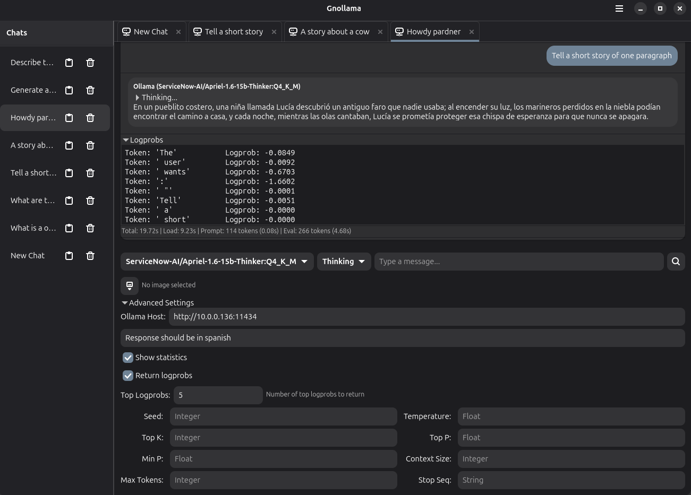

<div align="center">

# Gnollama

</img>

A Gnome user interface to [Ollama](https://ollama.com)
</div>

## Description

**Gnollama** is a modern, feature-rich GNOME user interface for [Ollama](https://ollama.com) built using Python, GTK4, and Libadwaita. It provides a native, responsive Linux desktop experience for interacting with LLMs.

Whether you are developing, experimenting, or chatting with local models, Gnollama makes it easy to run prompts across multiple local or remote hosts simultaneously.

## Features

* **Multi-Host Management**: Easily connect to different Ollama servers. Add, edit, or delete configurations, verify host status, and define a default host.
* **Dual Tab Workflows**:
  * **New Chat (`/api/chat`)**: Multi-turn sessions that preserve conversation context.
  * **New Response (`/api/generate`)**: Single-turn completions ideal for prompt engineering and testing.
* **Conversation History & Sidebar**:
  * Automatically saves chat logs and model configurations between runs.
  * **Pin Chats**: Pin essential conversations to the top of your history list.
  * **Popover Options**: Use a three-vertical-dots menu on any saved chat to quickly Pin, Rename, or Delete.
* **Model Manager**:
  * Pull or delete models directly from the UI.
  * View comprehensive model info, including size, parameter specifications, Modelfiles, templates, and licenses.
  * Switch between Installed and Running models for the selected host. Inspect memory, VRAM, context length, and expiry, or unload a model while keeping its downloaded files.
  * Running models refresh every five seconds while that view is visible. Unload is unavailable while Gnollama has an active response using the model.
* **Structured Output**: Choose Text, JSON, or JSON Schema in Advanced Settings for either Chat or Response tabs. Paste or import a schema, validate responses locally, and copy or save JSON. The raw response and validation result remain in saved chat history.
* **Tool Calling Playground**: Define function tools in Chat tabs, inspect model calls and argument validation, supply mock results, and continue with the current model and settings. Import/export definitions as JSON and reopen pending rounds from saved history.
* **Model Lifetime**: Choose the server default, unload after a reply, five or thirty minutes, indefinitely, or a custom duration in seconds in Advanced Settings. This setting applies to requests from that tab.
* **Rich Markdown & Code Rendering**: Full Markdown support and code syntax highlighting (powered by GTKSourceView 5).
* **Multimodal Image Support**: Upload and attach multiple images to your prompts for vision-enabled models.
  * Models explicitly lacking vision cannot receive new attachments. Earlier images remain visible and saved but are omitted from outgoing history for those models, with a notice in the composer.
  * Hosts without capability metadata retain manual image support, marked as unknown.
* **Thinking & completion Details**:
  * Separate display of Ollama's native thinking stream, with model-dependent thinking controls.
  * Display generation stats (including cached prompt tokens, finish reason, and tokens/second) and logprobs.
* **Stop Responses**: Stop generation while keeping partial answers in chat history. Pending history writes finish before the application quits.
* **Adaptive GNOME Navigation**: Native tabs support reordering and loading indicators. The Pinned and Recent sidebar collapses on narrow windows. Use Ctrl+W to close a tab, Ctrl+Page Up/Down to switch tabs, and F9 to toggle the sidebar.

### Structured output details

Selecting JSON Schema opens the editor when no schema has been applied. Paste or import a schema and click Apply; use Edit Schema to change it later. If a schema is missing or invalid when sending, the editor shows the problem and keeps your prompt intact.

Describe the desired JSON in your prompt; Gnollama does not rewrite prompts or change the temperature automatically. The schema editor accepts self-contained JSON Schema objects, defaults to Draft 2020-12, and honors supported explicit `$schema` versions. References must resolve within the imported document; external schemas are not fetched. Local validation does not guarantee that Ollama's generation engine supports every JSON Schema keyword.

Completed responses show JSON syntax or schema errors with locations. Valid JSON can be exported even when it does not match the schema. Raw text can always be copied; stopped or failed responses remain marked incomplete. JSON formatting rejects duplicate keys and non-finite or unrepresentably large floating-point values to avoid silently changing their meaning. Ollama Cloud currently does not support structured outputs; see [Ollama's documentation](https://docs.ollama.com/capabilities/structured-outputs).

### Testing tool calling

1. Open **New Chat**, select a tool-capable model, and enable **Advanced Settings → Tool Calling**. The definition editor opens automatically when empty.
2. Click **Example**, then **Apply**. This loads five coding-harness tools: `list_files`, `read_file`, `search_code`, `replace_in_file`, and `run_command`. Definitions accept an Ollama `tools` array with unique function names and self-contained object parameter schemas.
3. Send: **Inspect calculator.py. Its add function subtracts instead of adding. Read the file, fix it with the available tools, then run python3 -m unittest -v and report the test result.**
4. Inspect each call and its argument check. Click **Enter Result…**, supply a mock result, and click **Save Result**. For `read_file`, use the sample file contents below. For a correct `replace_in_file` call, use `{"success":true,"replacements":1}`. For `run_command`, use `{"exit_code":0,"stdout":"","stderr":"Ran 3 tests in 0.001s\n\nOK\n"}`.
5. Click **Continue** after each round. The model receives the original call and your mock result and can answer or request another tool round. For multiple calls, save a result for each before continuing. Empty strings are valid mock results when explicitly saved.

Sample contents to supply for `read_file`:

```python
def add(a, b):
    return a - b
```

Gnollama does not execute functions or connect to MCP servers. Tool-capability notices are advisory so you can test server behavior. Model and server support vary; a model may answer without calling a tool or reject the tools parameter.

Each continuation uses the currently selected host, model, definitions, thinking, and generation settings. Earlier calls retain their original arguments and validation. Text, JSON, and JSON Schema can all be combined with tools; final-output validation applies to completed responses without tool calls, and server compatibility errors remain visible. Tool results themselves accept arbitrary text and are not constrained by the assistant output schema.

Applied definitions and saved mock results persist per chat, including chats closed before sending a first prompt. Import/export files to reuse definitions across chats. While a round is pending, supply its results or choose **Cancel Tool Round** before sending another prompt. Cancellation retains supplied results and records cancellation text for unanswered calls; it does not contact the server. Reopening a pending round never starts a request automatically. Incomplete and malformed calls remain inspectable but cannot be continued.





## Motivation

I wanted a GNOME application for Ollama that I could use to test and experiment with different models. I have multiple computers with Ollama and wanted a way to easily query and compare the responses from all of them using the same interface. Perhaps others would find this useful as well so here you go.

## Build

*gnollama* can be built and run with [GNOME Builder](https://wiki.gnome.org/Apps/Builder).

1. Open GNOME Builder
2. Click the **Clone Repository** button
3. Enter `https://github.com/jackrabbithanna/gnollama.git` in the field **Repository URL**
4. Click the **Clone Project** button
5. Click the **Run** button to start building application

### Meson

Requires Python 3.10+, PyGObject, GTK 4.18+, libadwaita 1.9+, libsoup 3, jsonschema 4.26+, and Markdown. The Flatpak manifest uses GNOME 50 and builds the current checkout. It bundles checksum-pinned schema-validation dependencies for aarch64 and x86_64.
Code highlighting requires [GTKSourceView](https://wiki.gnome.org/Projects/GtkSourceView) version 5

To install in Ubuntu:
```bash
apt-get install libgtksourceview-5-0 libgtksourceview-5-common libgtksourceview-5-dev
apt-get install gir1.2-gtksource-5
apt-get install python3-markdown python3-jsonschema python3-gi gir1.2-soup-3.0
```

```bash
meson setup build
meson compile -C build
meson install -C build
```
You can then run `gnollama` to execute the application.

## Validation

Run `meson test -C build --print-errorlogs` after building. Regression tests use temporary databases and a local HTTP fixture server; they do not contact your Ollama servers. GTK smoke tests require a display and are skipped when none is available.

GNOME Builder builds the repository Flatpak manifest from the current checkout. For a command-line Flatpak build, use:

```bash
flatpak-builder --user --force-clean /tmp/gnollama-flatpak-build io.github.jackrabbithanna.Gnollama.json
```

## TODO

*   More UI Multi-lingual translations
*   Embeddings?
 
## Contribute

The [GNOME Code of Conduct](https://conduct.gnome.org/) is applicable to this project


## License

*gnollama* is released under the terms of the [GNU General Public License V3](https://www.gnu.org/licenses/gpl-3.0.html).

No warranty provided. No guarantee it does anything at all. Use at your own risk.
